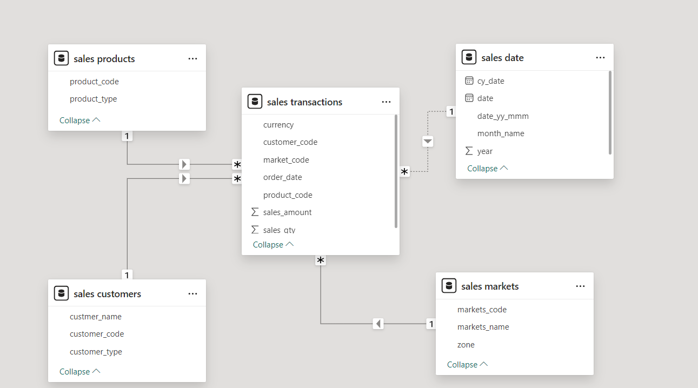
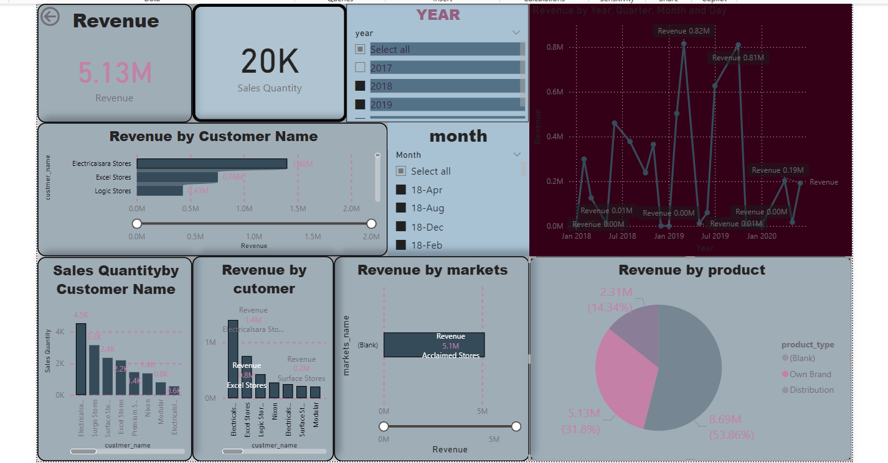

# Sales Data Analysis Dashboard

## Overview
This project demonstrates an insightful sales data analysis using Power BI. The dashboard provides a comprehensive view of revenue trends, customer performance, and product analysis to help businesses make data-driven decisions.

## Key Features
1. **Revenue Insights**:
   - Total revenue: **5.13M**
   - Total sales quantity: **20K**
   
2. **Revenue by Customer**:
   - Top performing customers include:
     - Electricalsara Stores: **1.40M**
     - Excel Stores: **0.76M**
     - Logic Stores: **0.43M**

3. **Sales Quantity by Customer**:
   - Visualizes the number of sales for each customer, with Electricalsara Stores leading at **4.5K**.

4. **Revenue by Markets**:
   - Total revenue split by markets highlights key contributors.

5. **Revenue by Product**:
   - Distribution of revenue by product types:
     - **Own Brand**: 53.86%
     - **Distribution**: 31.8%

6. **Revenue Trends**:
   - Yearly, quarterly, monthly, and daily revenue trends are visualized for deeper insights into sales performance over time.

7. **Dynamic Filters**:
   - Users can filter by **year** and **month** to explore specific time periods.

## Tools & Technologies Used
- **Power BI**: For creating interactive visualizations and dashboards.
- **DAX**: For advanced calculations and measures.
- **SQL**: For data extraction and preparation.

## Data Model
The project utilizes a star schema for efficient data modeling and querying. Below is the structure of the data model:

### **Tables in the Data Model**:
1. **Fact Table**:
   - `sales transactions`: Contains sales-related data, including sales amount, quantity, and associated codes.

2. **Dimension Tables**:
   - `sales products`: Product details such as product code and product type.
   - `sales customers`: Customer details including customer name, code, and type.
   - `sales markets`: Market details like market code, name, and zone.
   - `sales date`: Date-related fields including year, month, and day.

This design ensures optimized queries and clear relationships between tables for insightful analysis.

## How to Use
1. Open the provided `.pbix` file in Power BI Desktop.
2. Explore the interactive filters to view specific insights.
3. Use the visualizations to analyze:
   - Customer performance
   - Market trends
   - Product-specific revenue

## Dashboard

## Insights Derived
- Electricalsara Stores is the top-performing customer, contributing the highest revenue.
- **Own Brand** products generate the majority of the revenue.
- Sales peak during certain months, indicating potential seasonal trends.

## Future Enhancements
- Add predictive analytics to forecast future sales trends.
- Integrate real-time data updates for up-to-date insights.
- Include more KPIs like profit margins and customer retention rates.

---

Feel free to explore the project and share feedback. Contributions are welcome!

---

## Contact
For any queries or collaboration opportunities, feel free to reach out:
- **LinkedIn**: [Roksana Akter](www.linkedin.com/in/roksana00mymensingh)
- **GitHub**: [SalesInsight_Repository](https://github.com/Roksana18cse04/PowerBIDashboadDesign)
